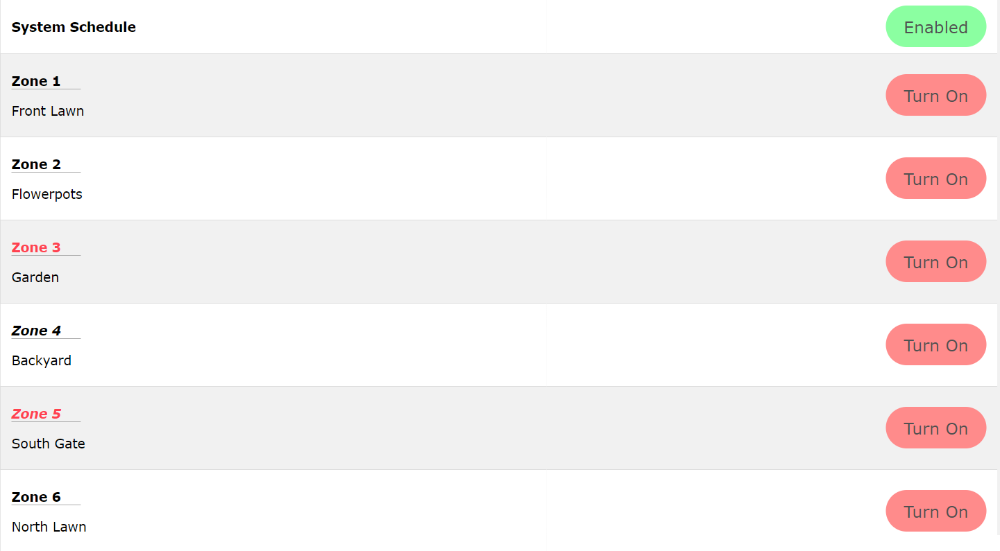

## A lightweight web page to control sprinkler systems on a raspberry pi.
  

  
  

### FEATURES
* Easy to use interface.
* Quick set up.
* Mobile support.
* Customizable sprinkler name and run time.
* Automatic running of the schedule (each zone from top to bottom.)
* Automatic shut off of sprinklers that are turned on from web page

### SETUP

- On debian, run the following command (after updating):
  `# apt install apache2 php libapache2-mod-php php-mysql composer mariadb-server cron`
- Make sure "AllowOverride" in `/etc/apache/apache2.conf` is set to `All`
- Run:
  - `# a2enmod php`
  - `# apachectl restart`
* Once you verify that apache is running properly, navigate to your phpmyadmin page, and create a database called `SQLSprinkler`
  * (**Recommended**) You may wish to create a user that only has access to this database.
    * The user must have INSERT, UPDATE, DELETE, SELECT and CREATE permissions.
  1) Update the `.env-sample` file to contain the username and password of the user you used to edit the database, save it as `.env`.
  2) Run `compose install` in the project root directory
      - You may need to install composer with the following commands if your system does not have a package for it
        - `wget -O composer-setup.php https://getcomposer.org/installer`
        - `sudo php composer-setup.php --install-dir=/usr/bin --filename=composer`
  3) Run `bash setup_mysql.sh` to setup the database.
  4) Navigate to `http://localhost/SQLSprinkler` to see if the page loads.
  5) Click on the bottom left icon, click on settings, then click on the bottom left icon again, then click the plus sign to start adding sprinkler systems.
  6) Run the following command `sudo apt install python3 python3-pip`
  7) Run: `pip install pymysql python-dotenv RPi.GPIO`
  8) Add the following line to `/etc/sudoers` : `www-data        ALL=NOPASSWD: /var/www/html/modules/SQLSprinkler/lib/*.py`
  9) Run `sudo -s`
  10) Run `su www-data -s /bin/bash`
  11) Run `crontab -e`
    * Add your schedule for when you want the system to run automatically.
    * If you need help, see [this link](!http://crontab.guru)
    * Please use the following command: `sudo /var/www/html/modules/SQLSprinkler/lib/sys.py`
    * After the configuration of the cron tab, save and exit.
  12) Done!

#### TODO
* Write a script to run setup automatically.
* Add a user to run python commands.
* Add a day schedule (like A and B days) for zones (?)
* Add a script to allow user to control when the system automatically runs (cron) (?)
* Better mobile support
* Per-zone auto off timer (currently zone run time) 
* Web interface run time configuration(?)
* Schedule builder (?)

### DEPENDENCIES
#### Back-end
-   python3
-   maria-db
-   MySQL
-   PHP7 or greater
-   Composer
-   MariaDB
-   python-dotenv
-   pymysql
-   RPi.GPIO
-   php-mysql
-   apache2
-   pip
-   Cron
#### Front-end
-   jquery
-   w3.css
-   Font Awesome

### REQUIREMENTS

-   A raspberry pi running buster or better
-   A stable internet connection

### ADDITIONAL INFORMATION
* There can only be one zone running at a time.
* As of now, all zones are configured to automatically shut off if turned on from the web page after their respective run time has elapsed.
* This system relies on relays to control the sprinkler system (one relay per zone)
    * General knowledge of how to wire an electrical system is required.
        * Please be careful while handling electricity. I am not responsible for anything. 

Copyright 2021 Gavin Pease

